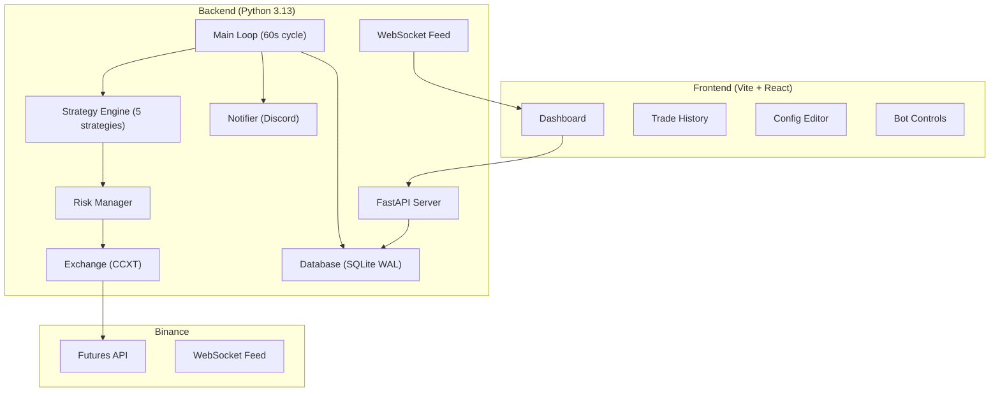

# OmniTrader — Roadmap

**Version**: 1.0
**Date**: 2026-02-24
**Author**: AI Product Owner & Finance Strategist
**Status**: Draft — Pending Founder Review

---

## 🔹 Executive Summary

OmniTrader is a **self-hosted, automated BTC/USDT Futures trading bot** targeting sustainable risk-adjusted returns through a portfolio of quantitative strategies on Binance. The system is currently an MVP with paper trading, a single-pair focus (BTC/USDT), 5 pluggable strategies, and a React dashboard for monitoring.

**Current state**: Working MVP with EMA, ADX, Bollinger Bands, Breakout, and Z-Score strategies — all paper-traded with simulated capital. The system already includes a risk management layer (position sizing, SL/TP, circuit breaker, trailing stops), a FastAPI backend, WebSocket live feed, and Docker Compose deployment.

**Product thesis**: Generate consistent, positive expectancy returns by combining trend-following and mean-reversion strategies with strict risk management, regime awareness, and disciplined position sizing — **not** by promising outsized returns.

> [!CAUTION]
> **Profit Realism Disclaimer**: Sustained monthly returns above 5–10% risk-adjusted are exceptionally rare in crypto. Any strategy claiming >15–25% monthly returns sustained over 6+ months is either taking extreme hidden risk, is curve-fitted to historical data, or both. This Roadmap designs for **capital preservation first, growth second**.

---

## 🔹 Target Market & User Persona

### Primary Persona: Solo Retail Trader / Technical Enthusiast

| Attribute | Profile |
|-----------|---------|
| **Type** | Retail trader with programming ability |
| **Capital range** | $500–$10,000 initially, scaling to $25k+ |
| **Risk appetite** | Moderate — willing to accept 10–15% max drawdown |
| **Trading experience** | Intermediate — understands leverage, liquidation, basic TA |
| **Goal** | Supplement income, not replace it. Outperform holding BTC |
| **Time commitment** | Set-and-monitor, not day-trading manually |
| **Revenue model** | Personal use — no subscription, no AUM fees |

### Non-Targets (Explicitly)

- **Prop desks**: Require HFT-grade latency (<1ms), co-location, FIX protocol
- **Institutional funds**: Need audited track records, regulatory compliance, multi-custodian
- **Crypto-naive retail**: No KYC awareness, no risk tolerance, expects "guaranteed returns"

### Capital Preservation vs. High Yield Decision

> **Capital preservation is the primary objective.** Growth is secondary. The system must survive a 50% BTC crash (like Nov 2022 or May 2021) with <15% portfolio drawdown. This constraint drives all position sizing, leverage, and strategy selection decisions.

---

## 🔹 Profit Strategy Model

### Strategy Portfolio Overview

The current codebase implements 5 strategies. Below is a financially rigorous assessment of each:

---

#### 1. EMA Crossover + Volume (`ema_volume`)

| Dimension | Assessment |
|-----------|------------|
| **Market condition** | Strong trending markets (BTC trending for 2+ weeks) |
| **Expected return** | 2–6% monthly in trending regimes; **negative** in chop |
| **Risk profile** | Medium — whipsaws during consolidation destroy edge |
| **Capital efficiency** | Low — signal frequency is ~2–4 trades/week on 15m |
| **Failure scenario** | Extended sideways market (3–6 months), whipsaw cascade |
| **Required indicators** | EMA(9), EMA(21), Volume SMA(20) |
| **Overfitting risk** | Low — simple, well-studied indicator. Hard to overfit |
| **Backtesting requirement** | Minimum 2 years BTC data across bull/bear/sideways |

> [!NOTE]
> EMA crossover is a proven, simple strategy but **it will bleed during ranging markets**. The current config has no regime filter — ATR or ADX should gate signal generation. The ADX strategy partially addresses this, but they don't compose yet.

---

#### 2. ADX Trend Filter (`adx_trend`)

| Dimension | Assessment |
|-----------|------------|
| **Market condition** | Only trades when ADX >25 (confirmed trend) |
| **Expected return** | 3–8% monthly when deployed correctly |
| **Risk profile** | Lower than pure EMA — filters out chop |
| **Capital efficiency** | Medium — waits for confirmed trends, fewer trades |
| **Failure scenario** | ADX >25 during false breakout / news-driven spike |
| **Required indicators** | ADX(14), EMA(10), EMA(21), Volume |
| **Overfitting risk** | Low-medium — threshold (25) is a standard but arbitrary |
| **Backtesting requirement** | Test threshold sensitivity: 20, 25, 30, 35 |

**Assessment**: This is the strongest strategy in the current portfolio. ADX filtering removes the primary failure mode of EMA crossover (ranging markets). **Recommended as primary strategy for initial live deployment.**

---

#### 3. Bollinger Bands + RSI (`bollinger_bands`)

| Dimension | Assessment |
|-----------|------------|
| **Market condition** | Ranging/mean-reverting markets |
| **Expected return** | 2–5% monthly in stable ranges |
| **Risk profile** | High during breakouts — catches falling knives |
| **Capital efficiency** | High — trades more frequently in ranges |
| **Failure scenario** | Trend breakout after extended range (the worst mean-reversion trap) |
| **Required indicators** | BB(20, 2σ), RSI(14) |
| **Overfitting risk** | Medium — RSI thresholds (30/70) are standard but regime-dependent |
| **Backtesting requirement** | Must test across 2022 bear market to validate drawdown |

> [!WARNING]
> Mean-reversion strategies in crypto are **substantially more dangerous** than in equities. BTC can trend 40%+ in a single month. Without a strong trend filter to disable this strategy during breakouts, it will produce catastrophic losses during regime shifts. **Must not run simultaneously with trend-following strategies without a regime classifier.**

---

#### 4. Breakout Strategy (`breakout`)

| Dimension | Assessment |
|-----------|------------|
| **Market condition** | Post-consolidation breakouts |
| **Expected return** | Highly variable — 5–15% when catching real breakouts, negative on false breakouts |
| **Risk profile** | High — false breakout rate in crypto is estimated at 60–70% |
| **Capital efficiency** | Low — most breakouts fail |
| **Failure scenario** | Liquidity sweep / stop hunt (very common on Binance Futures) |
| **Required indicators** | N-period high/low (20) |
| **Overfitting risk** | Medium — period selection is sensitive |
| **Backtesting requirement** | Must account for slippage on breakout entries (spreads widen) |

> [!CAUTION]
> Breakout strategies suffer heavily from **liquidity sweeps** on Binance Futures. Market makers and large players deliberately push price through obvious breakout levels to trigger stops, then reverse. Without liquidity analysis (order book depth, open interest shifts), this strategy has a high false-positive rate. **Not recommended for live deployment until Smart Money Concepts (SMC) filters are implemented.**

---

#### 5. Z-Score Mean Reversion (`z_score`)

| Dimension | Assessment |
|-----------|------------|
| **Market condition** | Statistical deviation from mean in stable markets |
| **Expected return** | 1–4% monthly in ranging environments |
| **Risk profile** | Same as Bollinger — dangerous during trends |
| **Capital efficiency** | Medium |
| **Failure scenario** | Structural regime change (e.g., post-halving rally) |
| **Required indicators** | Z-score(20), threshold ±2.0 |
| **Overfitting risk** | Medium — window and threshold are highly sensitive |
| **Backtesting requirement** | Walk-forward analysis mandatory to prevent overfitting |

---

#### 6. Smart Money Concepts (SMC) — Planned (P2)

| Dimension | Assessment |
|-----------|------------|
| **Market condition** | Institutional order flow analysis, all regimes |
| **Expected return** | Unknown until backtested — theoretical edge from order flow |
| **Risk profile** | Medium — requires high-quality implementation |
| **Capital efficiency** | High — sniper entries at POIs reduce risk per trade |
| **Failure scenario** | Incorrect structure identification, lag in detecting CHoCH |
| **Required indicators** | Multi-TF analysis, swing detection, OB/FVG/BOS/CHoCH |
| **Overfitting risk** | HIGH — discretionary concepts translated to rules often lose edge |
| **Backtesting requirement** | Extremely difficult to backtest properly; forward-test in paper mode first |

> [!IMPORTANT]
> SMC is a **discretionary framework** that loses significant edge when mechanized. The biggest risk is translating subjective chart reading into rigid code rules that miss context. I recommend implementing SMC as a **filter/confirmation layer** on top of existing strategies rather than a standalone signal generator. This is how institutional systematic funds use discretionary insights — as overlays, not primary signals.

---

### Strategy Composition Recommendation

```
Priority 1: ADX Trend (primary signal)
  + Regime Classifier (P2 #56) to enable/disable strategies
  + ATR-based stops (P2 #54) instead of fixed %

Priority 2: Bollinger/Z-Score (ONLY in classified ranging regime)
  + Must be DISABLED during trending regime

Priority 3: Breakout (ONLY with SMC liquidity sweep filter)
  + Without SMC, false breakout rate is too high

DO NOT: Run all strategies simultaneously without regime awareness.
         This is the #1 failure mode of retail bots.
```

---

## 🔹 Risk Framework

### Capital Hierarchy (Non-Negotiable)

```
Priority 1: Capital Survival       → Never risk >15% total drawdown
Priority 2: Exposure Control       → Never deploy >40% of capital
Priority 3: Drawdown Containment   → Daily loss cap 5%, consecutive loss pause
Priority 4: Edge Preservation      → Don't over-trade, don't over-optimize
Priority 5: Growth                 → Only after 1–4 are satisfied
```

### Position Sizing Model

| Parameter | Current (MVP) | Recommended | Rationale |
|-----------|--------------|-------------|-----------|
| **Model** | Fixed % (2%) | Volatility-adjusted (ATR-based) | Fixed % ignores market conditions; 2% in low-vol ≠ 2% in high-vol |
| **Position size** | 2% of wallet per trade | 0.5–3% scaled by 14-day ATR | Reduces size in volatile markets, increases in calm |
| **Max concurrent positions** | 1 | 1 (scale to 3 at P3) | Single-pair limits diversification; OK for MVP |
| **Max portfolio exposure** | 6% (2% × 3x leverage) | ≤20% notional at 3x | Current is conservative. Good. |

### Stop Loss / Take Profit

| Parameter | Current | Recommended | Rationale |
|-----------|---------|-------------|-----------|
| **Stop Loss** | 2% fixed | 1.5× ATR(14) | Fixed % doesn't adapt to volatility regime |
| **Take Profit** | 4% fixed (2:1 R:R) | 2× ATR(14) or trailing | Fixed TP leaves money on table in trends |
| **Trailing Stop** | 1% activation, 0.5% callback | ✅ Good | Keep; consider ATR-based trailing distance |
| **Time-based exit** | None | Exit after 48 candles (12h on 15m) if < 0.5× ATR move | Thesis decay — capital tied up in dead trades |

### Leverage Constraints

| Rule | Value | Rationale |
|------|-------|-----------|
| **Max leverage** | 3x isolated | ✅ Correct — conservative for retail |
| **Margin type** | Isolated | ✅ Correct — prevents cascading liquidation |
| **Liquidation buffer** | None currently | **Must add**: Alert at 50% of distance-to-liquidation |
| **Auto-deleverage** | None | Add at P1: reduce leverage to 1x if drawdown >10% |

### Circuit Breaker Enhancements

| Trigger | Action | Recovery |
|---------|--------|----------|
| Daily loss >5% | ✅ Pause trading | Auto-resume next UTC day |
| 3 consecutive losses | Reduce size 50% | Restore after 2 consecutive wins |
| Weekly loss >10% | Pause for 48h | Manual restart only |
| Abnormal volatility (>3× ATR) | Pause + Discord alert | Manual review then restart |
| Black swan (>10% BTC move in 1h) | **Flatten all positions immediately** | Manual restart only |

### Correlation & Diversification

For single-pair (BTC/USDT) — not applicable yet. When multi-pair is added (P2 #69):

- Max correlation exposure: 0.7 (BTC/ETH corr is ~0.85 — don't long both)
- Max sector exposure: 60% in any single sector (L1s, DeFi, memes)
- BTC dominance as correlation proxy: >60% BTC.D = only trade BTC

---

## 🔹 Technical Architecture

### Current Architecture Assessment



### Architecture Gaps (Must Address for Live Trading)

| Gap | Severity | Phase |
|-----|----------|-------|
| **No position reconciliation** | 🔴 Critical | P1 #44 |
| **No slippage tracking** | 🟠 High | P1 #42 |
| **No order fill verification** | 🔴 Critical | Before live |
| **No API rate limit handling** | 🟠 High | P1 |
| **No exchange error classification** | 🟠 High | P1 |
| **No database backup** | 🟡 Medium | P1 |
| **No heartbeat/watchdog** | 🟡 Medium | P1 |
| **Single point of failure (1 process)** | 🟡 Medium | P3+ |

### Recommended Additions Before Live Trading

1. **Order Fill Verification**: After every `market_long`/`market_short`, verify the fill price and quantity match expectations within tolerance. Log discrepancy.

2. **Heartbeat Monitor**: External process that pings `/api/health` every 30s. If 3 consecutive failures → send emergency Discord alert + attempt graceful restart.

3. **Position Reconciliation**: Every cycle, compare `Exchange.get_position()` with local `database` state. If mismatch → alert and take conservative action (flatten if unsure).

4. **API Rate Limiter**: CCXT handles basic rate limiting, but implement application-level tracking of remaining weight. Binance allows 2400 weight/min for futures; current cycle uses ~50–100 weight.

---

## 🔹 Binance Technical Constraints

### API Rate Limits

| Endpoint Type | Limit | OmniTrader Usage |
|--------------|-------|-----------------|
| **Request weight** | 2400/min (Futures) | ~80–120/cycle (60s) — 5% utilization ✅ |
| **Order rate** | 300/min | 1–2 orders/cycle — negligible ✅ |
| **WebSocket streams** | 200 connections | 0 currently (uses REST polling) |
| **IP ban threshold** | >2400 weight/min for 5+ min | Low risk at current rate |

> [!TIP]
> Current REST-only polling is fine for 60s cycles. When multi-pair trading is added (P2), switch to WebSocket market data to reduce API weight and improve latency.

### Order Types Available

| Order Type | Used? | Recommendation |
|-----------|-------|----------------|
| Market | ✅ Yes | Primary for entry. Accept ~0.1% slippage |
| Limit | ❌ No | Add for slippage reduction on entries (P3 #82) |
| Stop-Market | ✅ Yes (SL) | Used correctly |
| Take-Profit-Market | ✅ Yes (TP) | Used correctly |
| Stop-Limit | ❌ No | Consider for volatile markets (prevents bad fills) |
| OCO | ❌ No | Not available on Futures — use separate SL/TP |
| Trailing Stop | ❌ No (custom) | Binance has native trailing; current custom is fine |

### Fee Impact Analysis

| Fee Tier | Maker | Taker | Monthly Impact (100 trades, $1k notional) |
|----------|-------|-------|------------------------------------------|
| VIP 0 | 0.02% | 0.05% | $5–10 in fees |
| BNB discount (25%) | 0.015% | 0.0375% | $3.75–7.50 |

**Current all-taker execution costs ~0.1% round-trip (entry + exit)**. For the 2:1 R:R (2% SL, 4% TP) profile, fees consume 2.5% of winning trades and 5% of losing trades. **This is acceptable but should be tracked.**

### Funding Rate Considerations

- Funding occurs every 8h (00:00, 08:00, 16:00 UTC)
- Positive funding = longs pay shorts (bullish market)
- Negative funding = shorts pay longs (bearish market)
- Typical range: ±0.01% per 8h interval
- **Impact**: Holding a position through 3 funding intervals costs ~0.03%
- **Recommendation**: Log funding payments per trade. Consider funding-aware entry timing at P3.

### Liquidation Engine

- Binance uses **mark price** (not last price) for liquidation
- Insurance Fund covers liquidation shortfall
- At 3x isolated leverage, liquidation occurs at ~33% adverse move from entry
- With 2% SL, position should **never** reach liquidation distance
- **Recommendation**: Add liquidation price monitoring. Alert at 50% of distance-to-liquidation regardless of SL placement.

---

## 🔹 Data Requirements

| Data | Source | Frequency | Purpose | Current |
|------|--------|-----------|---------|---------|
| OHLCV (15m) | Binance REST | Every 60s | Strategy signals | ✅ |
| OHLCV (1h, 4h, 1d) | Binance REST | Every cycle | Multi-TF analysis | ❌ Needed for P2 |
| Account balance | Binance REST | Every cycle | Position sizing | ✅ |
| Open positions | Binance REST | Every cycle | State management | ✅ |
| Funding rate | Binance REST | Every 8h | Cost tracking | ❌ Needed for P1 |
| Order book (L2) | Binance WS | Real-time | Liquidity analysis | ❌ Needed for P2 |
| Historical trades (backtest) | Binance/Kaggle | Once | Backtesting | ❌ Needed for P3 |
| BTC dominance | CoinGecko | Daily | Regime analysis | ❌ Needed for P4 |
| DXY index | FRED/Yahoo | Daily | Macro correlation | ❌ Needed for P4 |
| Fear & Greed Index | Alternative.me | Daily | Sentiment filter | ❌ Needed for P4 |

---

## 🔹 Compliance & Legal Considerations

> [!WARNING]
> This section is informational, not legal advice. Consult a lawyer for your jurisdiction.

| Area | Consideration |
|------|--------------|
| **KYC** | Binance requires KYC for Futures trading. Bot operates under personal account. No third-party fund management. |
| **Tax** | All realized PnL is taxable income in most jurisdictions. SQLite trade log serves as audit trail. Export to CSV for tax reporting. |
| **AML** | Personal use with own funds — low AML risk. No mixing, no receiving from unknown sources. |
| **Regulatory** | Not operating as a fund manager, advisor, or broker. Personal trading bot. If accepting others' capital → significant regulatory burden (SEC/CVM). |
| **Data retention** | Trade history in SQLite is indefinite. Consider GDPR if hosting for others (not applicable for personal use). |
| **Terms of Service** | Binance permits API trading for personal accounts. Automated trading is allowed. Do not exceed API rate limits. |
| **Brazil (CVM)** | If operating from Brazil: crypto gains >R$35k/month exempt from income tax. Above threshold: 15–22.5% progressive rate. Must declare in IR annually. |

---

## 🔹 Revenue Model

**Current**: Personal use — no direct revenue model. The product generates value through trading PnL, not through monetization of the software.

### Future Monetization Options (If Desired)

| Model | Viability | Risk |
|-------|-----------|------|
| **SaaS subscription** ($29–99/mo) | Medium — crowded market (3Commas, Pionex, Cryptohopper) | Need 12+ months track record, support burden |
| **Performance fee** (15–20% of profit) | Low — legal complexity, requires fund structure | Regulatory nightmare without proper licensing |
| **Open-source + premium features** | Medium — community building | Giving away your edge |
| **Signal service** | Low-medium — sell signals, not execution | Liability if signals lose money |
| **Personal PnL only** | ✅ Recommended | Zero regulatory burden, pure value capture |

**Recommendation**: Keep as personal tool. The value is in the PnL generated, not in selling the software. Most profitable trading systems are private.

---

## 🔹 KPI & Success Metrics

### Phase 1 Targets (Paper Trading → $100 Live)

| Metric | Target | Rationale |
|--------|--------|-----------|
| **Sharpe Ratio** | >1.0 | Minimum for any systematic strategy to be deployed |
| **Sortino Ratio** | >1.5 | Downside-adjusted; more relevant for asymmetric crypto |
| **Max Drawdown** | <15% | Capital preservation mandate |
| **Monthly ROI** | 2–5% net of fees | Realistic for low-leverage trend following |
| **Win Rate** | >45% with 2:1 R:R | Positive expectancy threshold |
| **Profit Factor** | >1.5 | Gross profit / gross loss |
| **Avg Trade Duration** | 2–12 hours | Avoid overtrading and stale positions |
| **Slippage Drift** | <0.1% avg | Fill quality monitoring |
| **Daily Trades** | 1–4 | Avoid overtrading (commission drag) |

### Phase 2 Targets ($100 → $1,000 Live)

| Metric | Target |
|--------|--------|
| **Sharpe Ratio** | >1.2 |
| **Max Drawdown** | <12% |
| **Monthly ROI** | 3–7% net |
| **Paper → Live correlation** | >0.8 (paper results match live) |

### Anti-Targets (Red Flags)

| Signal | Meaning |
|--------|---------|
| Monthly ROI consistently >15% | Hidden risk, overfitting, or luck window |
| Win rate >70% with R:R <1 | Small wins, catastrophic losses pattern |
| Sharpe <0.5 for 3+ months | No edge — strategy needs rework |
| Paper ≠ Live results | Execution issues (slippage, timing, fills) |

---

## 🔹 Failure Scenarios & Mitigation

| Scenario | Probability | Impact | Mitigation |
|----------|-------------|--------|------------|
| **Extended sideways market (3–6mo)** | High (30%) | Strategy bleed, small losses compound | Regime classifier disables trend strategies; switch to mean-reversion |
| **Flash crash (>15% in 1h)** | Medium (10%/yr) | SL slippage, large single-trade loss | Black swan detector → flatten all. Use stop-limit, not stop-market |
| **Exchange downtime** | Medium (5%/yr) | Can't close position, SL doesn't execute | Set exchange-side SL (not just local). Position reconciliation on reconnect |
| **API rate limit ban** | Low (2%) | Trading paused for minutes/hours | Application-level rate tracking. Exponential backoff |
| **Overfitted strategy** | High (40%) | Works on backtest, fails live | Walk-forward analysis. Out-of-sample testing. Minimum 2yr backtest |
| **Liquidity gap (low-vol pair)** | Low for BTC | Large slippage on entry/exit | BTC/USDT has excellent liquidity. Risk increases with alt pairs |
| **Funding rate spike** | Medium (15%/yr) | Unexpected holding cost >0.1%/8h | Monitor funding; exit before funding if rate >3× normal |
| **Binance API change** | Medium (10%/yr) | Bot breaks silently | Pin CCXT version, test on update. Health check includes trade capability |
| **Local server failure** | Medium (20%/yr) | Bot goes offline with open position | Exchange-side SL/TP always set. Watchdog process. Cloud deployment (P3) |
| **Correlated losses across strategies** | High if no regime filter | All strategies lose simultaneously | Regime classifier + strategy exclusion rules |

---

## 🔹 Open Questions to Founder

> [!IMPORTANT]
> These questions must be answered before proceeding to live trading. They directly impact architecture and risk decisions.

### 1. Capital & Risk

1. **What is your initial live capital?** ($100? $500? $1,000?) — This determines position sizing granularity and minimum viable trade size on Binance.
2. **What is your maximum acceptable total drawdown?** (10%? 15%? 20%?) — This is the hardest constraint in the system.
3. **Are you comfortable with weeks of zero or negative returns?** Even well-designed systems have losing streaks.

### 2. Strategy

4. **Do you want to deploy a single strategy (ADX Trend) first, or multiple strategies from day one?** I recommend single-strategy validation before portfolio mode.
5. **How long will you paper-trade before going live?** Minimum recommended: 30 days with >50 trades.
6. **Are you interested in the SMC (Smart Money Concepts) approach, or should we prioritize backtesting classical strategies first?** SMC is harder to verify mechanically.

### 3. Operations

7. **Where will this run?** Local machine (downtime risk), VPS (cost), cloud (GCP e2-micro is ~$7/mo). This affects the watchdog and recovery architecture.
8. **How actively will you monitor?** Daily check-in? Hourly? Only Discord alerts?
9. **Do you want semi-automatic mode (approve trades via dashboard) before full-auto?** Recommended for the first 2 weeks of live trading.

### 4. Technical

10. **Do you already have Binance Futures enabled on your account?** Requires identity verification and a futures quiz.
11. **What is your Binance VIP tier?** Affects fee structure and API rate limits.
12. **Do you have historical BTC/USDT data for backtesting, or should we source it?**

---

## 🔹 Competitive Assessment

| Bot/Platform | Strength | Weakness | OmniTrader Differentiation |
|-------------|----------|----------|---------------------------|
| **3Commas** | Polish, DCA bots, multi-exchange | Black box, expensive ($49/mo), SaaS risk | Self-hosted, transparent, no subscription |
| **Cryptohopper** | Strategy marketplace, cloud-hosted | Overpromises returns, template strategies | Custom strategies, risk-first architecture |
| **Pionex** | Built-in grid bots, free | Limited to grid/DCA, no custom strategies | Full strategy engine, futures support |
| **Freqtrade** | Open-source, backtesting, mature | Complex config, no built-in UI, steep learning curve | React dashboard, simpler config, faster setup |
| **Jesse** | Research-grade backtesting | Heavy, no live dashboard | Lighter, real-time dashboard, faster iteration |

**OmniTrader's edge**: Self-hosted with full transparency, React dashboard for real-time monitoring, pluggable strategy architecture, and risk-first development strategy. The closest competitor is Freqtrade, but OmniTrader has a more accessible UI and simpler configuration.

---

## 🔹 Phase 4: Intelligence & Multi-Exchange Scaling (North Star)

These items represent the long-term vision for OmniTrader to transition from a single-pair bot to an institutional-grade intelligence platform.

### 1. High-Performance Infrastructure
- [ ] **QuestDB Time-Series Scaling**: Migrate OHLCV and tick data storage to QuestDB for high-performance time-series ingestion and querying. Essential for multi-pair scaling where SQLite/Postgres reach IOPS limits.

### 2. Advanced Multi-Exchange Engines (Neo4j)
- [ ] **Cross-Exchange Arbitrage Engine**: Build a graph-based pathfinding engine in Neo4j to identify 5+ hop profit loops across multiple exchanges and spot/futures markets.
- [ ] **Social Knowledge Graph**: Map and track influencer impact and "Smart Money" wallet movements to identify volatility precursors before they hit the ticker.

### 3. Local Intelligence Layer (Ollama)
- [ ] **Ollama "Intel Side-car"**: Utilize local LLMs for non-latency-critical background analysis:
    - **Market Narrative**: Real-time summary of price action vs. news sentiment.
    - **Trade Post-Mortems**: Automated analysis of failed trades to identify execution friction or strategy decay.
    - **Sentiment Filtering**: Deep analysis of social sentiment (news/socials) as a confirmation gate for high-leverage entries.

---

## 🔹 Immediate Next Steps (Recommended Prioritization)

Based on the current MVP state and this Roadmap analysis:

### Before Any Live Trading

1. ✅ ADX Trend as primary strategy (already implemented)
2. ❌ **Position reconciliation** (P1 #44) — Critical safety feature
3. ❌ **Slippage tracking** (P1 #42) — Must know fill quality
4. ❌ **Order fill verification** — Confirm every fill matches expectation
5. ❌ **Liquidation price monitoring** — Even with SL, monitor distance
6. ❌ **30-day paper trading validation** — Minimum 50 trades, calculate Sharpe

### First Live Deployment ($100)

7. Set up heartbeat/watchdog monitoring
8. Semi-automatic mode (dashboard approval) for first 2 weeks
9. Daily review of slippage, fills, and PnL in dashboard
10. After 30 live trades with positive expectancy → scale to $500

### Medium Term

11. Regime classifier (P2 #56) — The single highest-impact feature
12. ATR-based stops (P2 #54) — Replace fixed % with volatility-aware
13. Backtesting engine (P3 #74) — Can't optimize without backtesting
14. Walk-forward analysis (P3 #75) — Prevents overfitting
