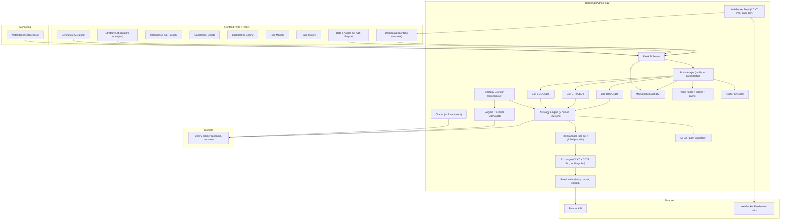

# OmniTrader — Roadmap

**Version**: 2.0
**Date**: 2026-03-09
**Author**: AI Product Owner & Finance Strategist
**Status**: Multi-Asset Autonomous Platform — Backend expansion in progress

---

## 🔹 Executive Summary

OmniTrader is a **self-hosted, multi-asset autonomous crypto futures trading platform** targeting sustainable risk-adjusted returns through a portfolio of quantitative strategies on Binance. The system supports multiple independent bots (one per trading pair), autonomous strategy selection based on regime classification, and a full-featured React dashboard for management, analytics, and strategy design.

**Current state**: Working MVP with EMA, ADX, Bollinger Bands, Breakout, and Z-Score strategies — paper-traded with simulated capital. Infrastructure includes: risk management layer (position sizing, SL/TP, circuit breakers, trailing stops, black swan detection, auto-deleverage), FastAPI backend, **Celery worker offloading**, **WebSocket live feed** (CCXT Pro), **Memgraph** graph database (replaced PostgreSQL + Neo4j + QuestDB), **Redis state persistence**, **Ollama** NLP sidecar, external **watchdog** process, and Docker Compose deployment (9 services). **TA-Lib** installed for 158+ indicator functions.

**Platform evolution (2026-03-09)**: Expanding from single BTC/USDT pair to multi-asset bot management. Each bot trades a specific pair with its own strategy, risk parameters, and lifecycle. An autonomous strategy selection engine picks the optimal strategy per regime. Users can create custom strategies via TA-Lib indicator combinations. Frontend dashboard (PROMPT.md) designed with 9 pages covering bot management, intelligence, charting, backtesting, risk monitoring, trade history, strategy lab, and settings.

**Product thesis**: Generate consistent, positive expectancy returns by combining trend-following and mean-reversion strategies with strict risk management, regime awareness, and disciplined position sizing — **not** by promising outsized returns.

> [!CAUTION]
> **Profit Realism Disclaimer**: Sustained monthly returns above 5–10% risk-adjusted are exceptionally rare in crypto. Any strategy claiming >15–25% monthly returns sustained over 6+ months is either taking extreme hidden risk, is curve-fitted to historical data, or both. This Roadmap designs for **capital preservation first, growth second**.

> [!CAUTION]
> **Institutional Audit (2026-03-03)**: A comprehensive code audit identified **7 critical bugs** (SL/TP failure non-fatal, paper mode PnL wrong, ATR stops not wired, API endpoints unprotected, Redis failures silent, position count hardcoded, paper SL/TP never simulated) and **9 high-priority issues**. All findings are tracked in [TASKS.md](TASKS.md). **DO NOT deploy live capital until all Critical (T6–T12) items are resolved.**

> [!WARNING]
> **Geopolitical Context (2026-03-03)**: Day 3 of US-Israeli war with Iran. Strait of Hormuz closed. Oil prices spiking, risk-off sentiment building. BTC correlation to equities increases during systemic stress. The system has **zero macro/geopolitical awareness** — no mechanism to detect or respond to this crisis. The prevailing "greed noise" (bullish retail sentiment during active geopolitical crisis) makes mean-reversion signals unreliable and all signals lower-confidence. See new section: **Geopolitical & Macro Risk Assessment**.

---

## 🔹 Target Market & User Persona

### Primary Persona: Solo Retail Trader / Technical Enthusiast

| Attribute | Profile |
|-----------|---------|
| **Type** | Retail trader with programming ability |
| **Capital range** | $500–$10,000 initially, scaling to $25k+ |
| **Risk appetite** | Moderate — willing to accept 10–15% max drawdown |
| **Trading experience** | Intermediate — understands leverage, liquidation, basic TA |
| **Goal** | Supplement income, not replace it. Outperform holding BTC |
| **Time commitment** | Set-and-monitor, not day-trading manually |
| **Revenue model** | Personal use — no subscription, no AUM fees |

### Non-Targets (Explicitly)

- **Prop desks**: Require HFT-grade latency (<1ms), co-location, FIX protocol
- **Institutional funds**: Need audited track records, regulatory compliance, multi-custodian
- **Crypto-naive retail**: No KYC awareness, no risk tolerance, expects "guaranteed returns"

### Capital Preservation vs. High Yield Decision

> **Capital preservation is the primary objective.** Growth is secondary. The system must survive a 50% BTC crash (like Nov 2022 or May 2021) with <15% portfolio drawdown. This constraint drives all position sizing, leverage, and strategy selection decisions.

---

## 🔹 Profit Strategy Model

### Strategy Portfolio Overview

The current codebase implements 5 strategies. Below is a financially rigorous assessment of each:

---

#### 1. EMA Crossover + Volume (`ema_volume`)

| Dimension | Assessment |
|-----------|------------|
| **Market condition** | Strong trending markets (BTC trending for 2+ weeks) |
| **Expected return** | 2–6% monthly in trending regimes; **negative** in chop |
| **Risk profile** | Medium — whipsaws during consolidation destroy edge |
| **Capital efficiency** | Low — signal frequency is ~2–4 trades/week on 15m |
| **Failure scenario** | Extended sideways market (3–6 months), whipsaw cascade |
| **Required indicators** | EMA(9), EMA(21), Volume SMA(20) |
| **Overfitting risk** | Low — simple, well-studied indicator. Hard to overfit |
| **Backtesting requirement** | Minimum 2 years BTC data across bull/bear/sideways |

> [!NOTE]
> EMA crossover is a proven, simple strategy but **it will bleed during ranging markets**. The current config has no regime filter — ATR or ADX should gate signal generation. The ADX strategy partially addresses this, but they don't compose yet.

---

#### 2. ADX Trend Filter (`adx_trend`)

| Dimension | Assessment |
|-----------|------------|
| **Market condition** | Only trades when ADX >25 (confirmed trend) |
| **Expected return** | 3–8% monthly when deployed correctly |
| **Risk profile** | Lower than pure EMA — filters out chop |
| **Capital efficiency** | Medium — waits for confirmed trends, fewer trades |
| **Failure scenario** | ADX >25 during false breakout / news-driven spike |
| **Required indicators** | ADX(14), EMA(10), EMA(21), Volume |
| **Overfitting risk** | Low-medium — threshold (25) is a standard but arbitrary |
| **Backtesting requirement** | Test threshold sensitivity: 20, 25, 30, 35 |

**Assessment**: This is the strongest strategy in the current portfolio. ADX filtering removes the primary failure mode of EMA crossover (ranging markets). **Recommended as primary strategy for initial live deployment.**

---

#### 3. Bollinger Bands + RSI (`bollinger_bands`)

| Dimension | Assessment |
|-----------|------------|
| **Market condition** | Ranging/mean-reverting markets |
| **Expected return** | 2–5% monthly in stable ranges |
| **Risk profile** | High during breakouts — catches falling knives |
| **Capital efficiency** | High — trades more frequently in ranges |
| **Failure scenario** | Trend breakout after extended range (the worst mean-reversion trap) |
| **Required indicators** | BB(20, 2σ), RSI(14) |
| **Overfitting risk** | Medium — RSI thresholds (30/70) are standard but regime-dependent |
| **Backtesting requirement** | Must test across 2022 bear market to validate drawdown |

> [!WARNING]
> Mean-reversion strategies in crypto are **substantially more dangerous** than in equities. BTC can trend 40%+ in a single month. Without a strong trend filter to disable this strategy during breakouts, it will produce catastrophic losses during regime shifts. **Must not run simultaneously with trend-following strategies without a regime classifier.**

---

#### 4. Breakout Strategy (`breakout`)

| Dimension | Assessment |
|-----------|------------|
| **Market condition** | Post-consolidation breakouts |
| **Expected return** | Highly variable — 5–15% when catching real breakouts, negative on false breakouts |
| **Risk profile** | High — false breakout rate in crypto is estimated at 60–70% |
| **Capital efficiency** | Low — most breakouts fail |
| **Failure scenario** | Liquidity sweep / stop hunt (very common on Binance Futures) |
| **Required indicators** | N-period high/low (20) |
| **Overfitting risk** | Medium — period selection is sensitive |
| **Backtesting requirement** | Must account for slippage on breakout entries (spreads widen) |

> [!CAUTION]
> Breakout strategies suffer heavily from **liquidity sweeps** on Binance Futures. Market makers and large players deliberately push price through obvious breakout levels to trigger stops, then reverse. Without liquidity analysis (order book depth, open interest shifts), this strategy has a high false-positive rate. **Not recommended for live deployment until Smart Money Concepts (SMC) filters are implemented.**

---

#### 5. Z-Score Mean Reversion (`z_score`)

| Dimension | Assessment |
|-----------|------------|
| **Market condition** | Statistical deviation from mean in stable markets |
| **Expected return** | 1–4% monthly in ranging environments |
| **Risk profile** | Same as Bollinger — dangerous during trends |
| **Capital efficiency** | Medium |
| **Failure scenario** | Structural regime change (e.g., post-halving rally) |
| **Required indicators** | Z-score(20), threshold ±2.0 |
| **Overfitting risk** | Medium — window and threshold are highly sensitive |
| **Backtesting requirement** | Walk-forward analysis mandatory to prevent overfitting |

---

#### 6. Smart Money Concepts (SMC) — Partially Implemented (Analysis Layer)

| Dimension | Assessment |
|-----------|------------|
| **Market condition** | Institutional order flow analysis, all regimes |
| **Expected return** | Unknown until backtested — theoretical edge from order flow |
| **Risk profile** | Medium — requires high-quality implementation |
| **Capital efficiency** | High — sniper entries at POIs reduce risk per trade |
| **Failure scenario** | Incorrect structure identification, lag in detecting CHoCH |
| **Required indicators** | Multi-TF analysis, swing detection, OB/FVG/BOS/CHoCH |
| **Overfitting risk** | HIGH — discretionary concepts translated to rules often lose edge |
| **Backtesting requirement** | Extremely difficult to backtest properly; forward-test in paper mode first |

**Implementation status (2026-03-03)**: `smc/structure.py` implements BOS/CHoCH detection with fractal swing detection and delayed confirmation (correctly mitigates lookahead bias). `smc/analysis.py` provides multi-timeframe coordination. **However**: the SMC module is **not registered in the strategy registry** and has **no integration path to influence trade signals**. It is dead code until wired as a filter layer. Order blocks, fair value gaps, and liquidity sweep detection are **not implemented**.

> [!IMPORTANT]
> SMC is a **discretionary framework** that loses significant edge when mechanized. The biggest risk is translating subjective chart reading into rigid code rules that miss context. I recommend implementing SMC as a **filter/confirmation layer** on top of existing strategies rather than a standalone signal generator. This is how institutional systematic funds use discretionary insights — as overlays, not primary signals.

---

### Strategy Composition Recommendation

> **Updated 2026-03-09**: With autonomous strategy selection (T38), bots auto-pick the best strategy per regime based on backtest/live scoring. Manual override still available.

```
Auto Mode (T38 — Autonomous Strategy Selection):
  Per bot, per regime, the selector picks the highest-scoring strategy:
  - TRENDING regime  → likely ADX Trend or EMA Volume (trend-following)
  - RANGING regime   → likely Bollinger Bands or Z-Score (mean-reversion)
  - VOLATILE regime  → reduced sizing, possibly ADX Trend with tighter stops
  Scoring: 0.4×Sharpe + 0.3×ProfitFactor + 0.3×WinRate (min 20 trades)
  Cooldown: min 4h between strategy rotations

Manual Mode (user locks strategy):
  Bot uses the specified strategy regardless of regime.
  Dashboard shows "Manual 🔒" badge.

Custom Strategies (T40):
  Users build strategies from TA-Lib indicator conditions.
  Custom strategies participate in auto-selection once backtested (≥20 trades).

Legacy Recommendation (still valid for initial deploy):
  Priority 1: ADX Trend (primary signal)
    + Regime Classifier ✅ implemented — needs hysteresis fix (T13)
    + ATR-based stops — configured but NOT wired to exchange orders (T9)

  Priority 2: Bollinger/Z-Score (ONLY in classified ranging regime)
    + Must be DISABLED during trending regime ✅ (regime gating works)

  Priority 3: Breakout — fix Donchian bug (T14) before any deployment

DO NOT: Run all strategies simultaneously without regime awareness.
         This is the #1 failure mode of retail bots.
```

> [!WARNING]
> **Audit Finding (2026-03-03)**: All strategies except `ema_volume` use **level-based** signals (not transitions). After a stop-loss hit, they immediately re-enter if the condition persists. This creates a "re-entry grinder" pattern — 3-5 consecutive losses in a single session before the circuit breaker fires. A `min_bars_between_entries` cooldown is required (TASKS.md T15).

> [!WARNING]
> **No Backtesting Engine Exists.** There is zero statistical evidence that any strategy has positive expectancy. The paper mode is the only testing mechanism, and it has critical bugs (PnL formula wrong, SL/TP never simulated). Building a backtesting engine (BACKLOG.md B1) is the single most important long-term investment.

---

## 🔹 Risk Framework

### Capital Hierarchy (Non-Negotiable)

```
Priority 1: Capital Survival       → Never risk >15% total drawdown
Priority 2: Exposure Control       → Never deploy >40% of capital
Priority 3: Drawdown Containment   → Daily loss cap 5%, consecutive loss pause
Priority 4: Edge Preservation      → Don't over-trade, don't over-optimize
Priority 5: Growth                 → Only after 1–4 are satisfied
```

### Position Sizing Model

| Parameter | Current (MVP) | Recommended | Rationale |
|-----------|--------------|-------------|-----------|
| **Model** | Fixed % (2%) | Volatility-adjusted (ATR-based) | Fixed % ignores market conditions; 2% in low-vol ≠ 2% in high-vol |
| **Position size** | 2% of wallet per trade | 0.5–3% scaled by 14-day ATR | Reduces size in volatile markets, increases in calm |
| **Max concurrent positions** | 1 | 1–5 per bot (T37), configurable global max | Multi-asset bot model supports multiple pairs simultaneously |
| **Max portfolio exposure** | 6% (2% × 3x leverage) | ≤20% notional at 3x, split across bots | Portfolio-level risk managed by BotManager (T37) |

### Stop Loss / Take Profit

| Parameter | Current | Recommended | Rationale |
|-----------|---------|-------------|-----------|
| **Stop Loss** | 2% fixed | 1.5× ATR(14) | Fixed % doesn't adapt to volatility regime |
| **Take Profit** | 4% fixed (2:1 R:R) | 2× ATR(14) or trailing | Fixed TP leaves money on table in trends |
| **Trailing Stop** | 1% activation, 0.5% callback | ✅ Good | Keep; consider ATR-based trailing distance |
| **Time-based exit** | None | Exit after 48 candles (12h on 15m) if < 0.5× ATR move | Thesis decay — capital tied up in dead trades |

> [!CAUTION]
> **Audit Finding (2026-03-03)**: Config has `use_atr_stops: true` with `atr_multiplier_sl: 1.5` and `atr_multiplier_tp: 2.0`, but **the code never applies them to exchange orders**. `_open_position()` always calls `calculate_stop_loss()` / `calculate_take_profit()` (fixed %). The `ohlcv` parameter is never passed to `validate_trade()`, so ATR stops are silently skipped. **The system believes it's using dynamic stops but is not.** Fix tracked in TASKS.md T9.

### Leverage Constraints

| Rule | Value | Rationale |
|------|-------|-----------|
| **Max leverage** | 3x isolated | ✅ Correct — conservative for retail |
| **Margin type** | Isolated | ✅ Correct — prevents cascading liquidation |
| **Liquidation buffer** | ✅ Implemented (0.5) | Alert at 50% of distance-to-liquidation |
| **Auto-deleverage** | ✅ Implemented | Reduce leverage to 1x if drawdown >10% — **⚠️ uses daily PnL reset, not peak-equity HWM (TASKS T16)** |

### Circuit Breaker Enhancements

| Trigger | Action | Recovery |
|---------|--------|----------|
| Daily loss >5% | ✅ Pause trading | Auto-resume next UTC day |
| 3 consecutive losses | Reduce size 50% | Restore after 2 consecutive wins |
| Weekly loss >10% | Pause for 48h | Manual restart only |
| Abnormal volatility (>3× ATR) | Pause + Discord alert | Manual review then restart |
| Black swan (>10% BTC move in 1h) | **Flatten all positions immediately** | Manual restart only |

### Correlation & Diversification

Multi-asset bot management (T37) introduces portfolio-level concerns:

- **Per-bot risk isolation**: Each bot has independent daily loss tracker, circuit breakers, position limits
- **Global portfolio risk**:
    - Max total allocation: sum of all bot allocations ≤ 100% of capital
    - Global drawdown circuit breaker: combined portfolio drops >10% from HWM → pause all bots
    - Max concurrent positions: configurable (default 5)
- **Correlation management** (T37 Phase 7d):
    - Max correlation exposure: 0.7 (BTC/ETH corr ~0.85 — warn when adding both)
    - Alert on high-correlation pair addition (warn but don't block)
    - Future: correlation matrix dashboard (BACKLOG B17)
- **BTC dominance as correlation proxy**: >60% BTC.D = consider reducing alt exposure

---

## 🔹 Geopolitical & Macro Risk Assessment

> Added 2026-03-03 in response to active geopolitical crisis.

### Current Crisis: US-Israeli War with Iran — Hormuz Closure

| Dimension | Assessment |
|-----------|------------|
| **Event** | US-Israeli military operations against Iran, Day 3 (2026-03-03). Strait of Hormuz closed to commercial shipping. |
| **Oil impact** | Immediate supply shock. ~20% of global oil transits Hormuz. Expect sustained oil price spike. |
| **Macro cascade** | Oil spike → inflation fears → central bank hawkishness → risk-off across equities → crypto sells off initially (risk asset correlation), potential flight-to-BTC narrative later |
| **BTC correlation shift** | During systemic geopolitical stress, BTC-equity correlation increases to ~0.5–0.7 (vs. ~0.2–0.3 normal). BTC behaves as **risk asset, not safe haven**, in the initial phase. |
| **Historical precedent** | Russia-Ukraine 2022: BTC dropped ~15% in first week, recovered partially. However, Hormuz closure is **unprecedented in modern crypto era** — no direct analog. |
| **Duration risk** | If conflict extends beyond 2 weeks, sustained risk-off could produce 3–6 month adverse regime for trend-following strategies. |

### "Greed Noise" Warning

When market sentiment diverges from geopolitical reality — bullish retail sentiment during active military conflict and supply chain disruption — this creates a **greed noise** environment:

- **Mean-reversion signals are unreliable**: Retail greed may temporarily support prices, but institutional risk-off selling can overwhelm at any moment. Buying "oversold" dips during systemic stress is the classic falling-knife pattern.
- **Trend signals are unreliable**: News-driven spikes (ceasefire rumors, escalation headlines) create false breakouts and whipsaws that destroy EMA/ADX trend detection.
- **Volatility will spike**: ATR will expand significantly. The regime classifier should toggle to VOLATILE (if hysteresis is fixed).
- **The system cannot detect this**: OmniTrader has zero macro awareness — no sentiment input, no news feed, no geopolitical risk factor. It will trade through the crisis as if nothing is happening.

### Recommended Crisis Protocol (Document for Future Implementation)

When a geopolitical crisis of this magnitude is active, the following parameter overrides should be applied:

| Parameter | Normal | Crisis Override | Rationale |
|-----------|--------|----------------|-----------|
| `leverage` | 3× | **1×** | Reduce ruin risk during extreme tail events |
| `position_size_pct` | 2.0% | **0.5%** | Minimize exposure per trade |
| `max_daily_loss_pct` | 5.0% | **2.0%** | Tighter circuit breaker |
| `strategy.name` | adx_trend | **adx_trend only** | Disable mean-reversion (falling knife risk) |
| Manual approval gate | Off | **On** | Human reviews each signal before execution |
| Mean-reversion strategies | Enabled in RANGING | **Disabled entirely** | Greed noise makes regime classification unreliable |

> [!IMPORTANT]
> This crisis protocol is **documented but not yet implementable** — the system lacks a `crisis_mode` config toggle, manual approval gate, or macro event detection. Implementation tracked in BACKLOG.md B4.

### Impact on OmniTrader Data Requirements

The current crisis exposes gaps in the data pipeline. The following are now higher priority:

| Data | Original Phase | New Priority | Rationale |
|------|---------------|-------------|-----------|
| Fear & Greed Index | P4 | **P2** | Essential to detect greed-noise divergence |
| DXY index | P4 | **P2** | Dollar strength drives risk-off in crypto |
| Oil futures (CL) | Not planned | **P2** | Direct indicator for Hormuz-class supply shocks |
| VIX / Crypto Vol Index | Not planned | **P2** | Cross-asset volatility regime detection |

---

## 🔹 Technical Architecture

### Current Architecture Assessment



### Architecture Gaps — Updated Post-Audit (2026-03-03)

| Gap | Original Status | Current Status | Ref |
|-----|----------------|----------------|-----|
| Position reconciliation | 🔴 Not implemented | ✅ Implemented (heuristic-based, fragile for multi-fill) | — |
| Slippage tracking | 🟠 Not implemented | ✅ Implemented (expected vs actual fill, threshold alerts) | — |
| Order fill verification | 🔴 Not implemented | ✅ Implemented (5 retries × 1s, matches by timestamp+side) | — |
| API rate limit handling | 🟠 Not implemented | ✅ Implemented (leaky-bucket, 2000/2400 capacity, per-endpoint weights) | — |
| Database backup | 🟡 Not implemented | ✅ Implemented (SQLite VACUUM INTO) | — |
| Heartbeat/watchdog | 🟡 Not implemented | ✅ Implemented (external process, Docker container, Discord alerts) | — |
| **SL/TP failure leaves naked position** | — | 🔴 **NEW — Critical** | T6 |
| **Paper mode PnL formula wrong** | — | 🔴 **NEW — Critical** | T7 |
| **Paper SL/TP never simulated** | — | 🔴 **NEW — Critical** | T8 |
| **ATR stops configured but not wired** | — | 🔴 **NEW — Critical** | T9 |
| **API mutation endpoints unprotected** | — | 🔴 **NEW — Critical** | T11 |
| **Redis failures silently swallowed** | — | 🔴 **NEW — Critical** | T12 |
| **Regime classifier no hysteresis** | — | 🟠 **NEW — High** | T13 |
| **Breakout strategy Donchian bug** | — | 🟠 **NEW — High** | T14 |
| **No backtesting engine** | — | 🔴 **NEW — Critical (research)** | B1 |
| **No macro/geopolitical awareness** | — | 🟠 **NEW — High** | B4 |
| Exchange error classification | 🟠 Not implemented | ❌ Still missing | — |
| Single point of failure | 🟡 Medium | ✅ Partially mitigated (Celery worker, watchdog) | — |

### Recommended Additions Before Live Trading

> ✅ Items 1–4 from the original roadmap (fill verification, heartbeat, reconciliation, rate limiter) are now **implemented**. Updated priorities below:

1. **SL/TP Retry Logic**: When SL/TP placement fails, retry 3× with exponential backoff. If all retries fail, flatten the position immediately. Never leave a naked position. (TASKS T6)

2. **Paper Mode Overhaul**: Fix PnL formula (entry×qty not entry²), add tick-by-tick SL/TP simulation against OHLCV data, emit simulated fills via event system. (TASKS T7, T8)

3. **ATR Stop Integration**: Pass OHLCV to `validate_trade()`, compute ATR(14)-based SL/TP, replace fixed % stops. (TASKS T9)

4. **API Authentication**: Add Bearer token auth to all mutation endpoints (/start, /stop, /config). Rate-limit auth failures. (TASKS T11)

---

## 🔹 Binance Technical Constraints

### API Rate Limits

| Endpoint Type | Limit | OmniTrader Usage |
|--------------|-------|-----------------|
| **Request weight** | 2400/min (Futures) | ~80–120/cycle (60s) — 5% utilization ✅ |
| **Order rate** | 300/min | 1–2 orders/cycle — negligible ✅ |
| **WebSocket streams** | 200 connections | ✅ WsFeed uses CCXT Pro (ticker, OHLCV, orders) |
| **IP ban threshold** | >2400 weight/min for 5+ min | Low risk at current rate |

> [!TIP]
> ✅ WebSocket integration complete (`ws_feed.py`). REST fallback is maintained if WS cache is insufficient. WS reduces API weight and provides sub-second ticker updates.

### Order Types Available

| Order Type | Used? | Recommendation |
|-----------|-------|----------------|
| Market | ✅ Yes | Primary for entry. Accept ~0.1% slippage |
| Limit | ❌ No | Add for slippage reduction on entries (P3 #82) |
| Stop-Market | ✅ Yes (SL) | Used correctly |
| Take-Profit-Market | ✅ Yes (TP) | Used correctly |
| Stop-Limit | ❌ No | Consider for volatile markets (prevents bad fills) |
| OCO | ❌ No | Not available on Futures — use separate SL/TP |
| Trailing Stop | ❌ No (custom) | Binance has native trailing; current custom is fine |

### Fee Impact Analysis

| Fee Tier | Maker | Taker | Monthly Impact (100 trades, $1k notional) |
|----------|-------|-------|------------------------------------------|
| VIP 0 | 0.02% | 0.05% | $5–10 in fees |
| BNB discount (25%) | 0.015% | 0.0375% | $3.75–7.50 |

**Current all-taker execution costs ~0.1% round-trip (entry + exit)**. For the 2:1 R:R (2% SL, 4% TP) profile, fees consume 2.5% of winning trades and 5% of losing trades. **This is acceptable but should be tracked.**

### Funding Rate Considerations

- Funding occurs every 8h (00:00, 08:00, 16:00 UTC)
- Positive funding = longs pay shorts (bullish market)
- Negative funding = shorts pay longs (bearish market)
- Typical range: ±0.01% per 8h interval
- **Impact**: Holding a position through 3 funding intervals costs ~0.03%
- **Recommendation**: Log funding payments per trade. Consider funding-aware entry timing at P3.

### Liquidation Engine

- Binance uses **mark price** (not last price) for liquidation
- Insurance Fund covers liquidation shortfall
- At 3x isolated leverage, liquidation occurs at ~33% adverse move from entry
- With 2% SL, position should **never** reach liquidation distance
- **Recommendation**: Add liquidation price monitoring. Alert at 50% of distance-to-liquidation regardless of SL placement.

---

## 🔹 Data Requirements

| Data | Source | Frequency | Purpose | Current |
|------|--------|-----------|---------|---------|
| OHLCV (15m) | Binance REST/WS | Every 60s | Strategy signals | ✅ |
| OHLCV (1h, 4h, 1d) | Binance REST | Every cycle | Multi-TF analysis | ❌ Needed for P2 |
| OHLCV (multi-pair) | Binance WS | Real-time | Per-bot strategy signals (T37) | 🔄 Planned |
| Account balance | Binance REST | Every cycle | Position sizing | ✅ |
| Open positions (multi) | Binance REST | Every cycle | Per-bot state management (T37) | 🔄 Planned |
| Markets / tradeable pairs | Binance REST | Every 5min | Bot creation: symbol picker (T42) | 🔄 Planned |
| TA-Lib indicators (158+) | Computed locally | Per cycle | Strategy signals + custom strategies (T39, T40) | ✅ Installed |
| Strategy scores | Memgraph | Per trade | Autonomous strategy selection (T38) | 🔄 Planned |
| Custom strategy configs | Memgraph | On demand | Strategy Lab CRUD (T40) | 🔄 Planned |
| Funding rate | Binance REST | Every 8h | Cost tracking | ❌ Needed for P1 |
| Order book (L2) | Binance WS | Real-time | Liquidity analysis | ❌ Needed for P2 |
| Historical trades (backtest) | Binance/Kaggle | Once | Backtesting (T35) | 🔄 Planned |
| BTC dominance | CoinGecko | Daily | Regime analysis | ❌ Needed for P4 |
| DXY index | FRED/Yahoo | Daily | Macro correlation | ❌ Needed for P4 |
| Fear & Greed Index | Alternative.me | Daily | Sentiment filter | ❌ Needed for P4 |

---

## 🔹 Compliance & Legal Considerations

> [!WARNING]
> This section is informational, not legal advice. Consult a lawyer for your jurisdiction.

| Area | Consideration |
|------|--------------|
| **KYC** | Binance requires KYC for Futures trading. Bot operates under personal account. No third-party fund management. |
| **Tax** | All realized PnL is taxable income in most jurisdictions. SQLite trade log serves as audit trail. Export to CSV for tax reporting. |
| **AML** | Personal use with own funds — low AML risk. No mixing, no receiving from unknown sources. |
| **Regulatory** | Not operating as a fund manager, advisor, or broker. Personal trading bot. If accepting others' capital → significant regulatory burden (SEC/CVM). |
| **Data retention** | Trade history in SQLite is indefinite. Consider GDPR if hosting for others (not applicable for personal use). |
| **Terms of Service** | Binance permits API trading for personal accounts. Automated trading is allowed. Do not exceed API rate limits. |
| **Brazil (CVM)** | If operating from Brazil: crypto gains >R$35k/month exempt from income tax. Above threshold: 15–22.5% progressive rate. Must declare in IR annually. |

---

## 🔹 Revenue Model

**Current**: Personal use — no direct revenue model. The product generates value through trading PnL, not through monetization of the software.

### Future Monetization Options (If Desired)

| Model | Viability | Risk |
|-------|-----------|------|
| **SaaS subscription** ($29–99/mo) | Medium — crowded market (3Commas, Pionex, Cryptohopper) | Need 12+ months track record, support burden |
| **Performance fee** (15–20% of profit) | Low — legal complexity, requires fund structure | Regulatory nightmare without proper licensing |
| **Open-source + premium features** | Medium — community building | Giving away your edge |
| **Signal service** | Low-medium — sell signals, not execution | Liability if signals lose money |
| **Personal PnL only** | ✅ Recommended | Zero regulatory burden, pure value capture |

**Recommendation**: Keep as personal tool. The value is in the PnL generated, not in selling the software. Most profitable trading systems are private.

---

## 🔹 KPI & Success Metrics

### Phase 1 Targets (Paper Trading → $100 Live)

| Metric | Target | Rationale |
|--------|--------|-----------|
| **Sharpe Ratio** | >1.0 | Minimum for any systematic strategy to be deployed |
| **Sortino Ratio** | >1.5 | Downside-adjusted; more relevant for asymmetric crypto |
| **Max Drawdown** | <15% | Capital preservation mandate |
| **Monthly ROI** | 2–5% net of fees | Realistic for low-leverage trend following |
| **Win Rate** | >45% with 2:1 R:R | Positive expectancy threshold |
| **Profit Factor** | >1.5 | Gross profit / gross loss |
| **Avg Trade Duration** | 2–12 hours | Avoid overtrading and stale positions |
| **Slippage Drift** | <0.1% avg | Fill quality monitoring |
| **Daily Trades** | 1–4 | Avoid overtrading (commission drag) |

### Phase 2 Targets ($100 → $1,000 Live)

| Metric | Target |
|--------|--------|
| **Sharpe Ratio** | >1.2 |
| **Max Drawdown** | <12% |
| **Monthly ROI** | 3–7% net |
| **Paper → Live correlation** | >0.8 (paper results match live) |

### Anti-Targets (Red Flags)

| Signal | Meaning |
|--------|---------|
| Monthly ROI consistently >15% | Hidden risk, overfitting, or luck window |
| Win rate >70% with R:R <1 | Small wins, catastrophic losses pattern |
| Sharpe <0.5 for 3+ months | No edge — strategy needs rework |
| Paper ≠ Live results | Execution issues (slippage, timing, fills) |

---

## 🔹 Failure Scenarios & Mitigation

| Scenario | Probability | Impact | Mitigation | Status |
|----------|-------------|--------|------------|--------|
| **Extended sideways market (3–6mo)** | High (30%) | Strategy bleed, small losses compound | Regime classifier disables trend strategies; switch to mean-reversion | ✅ Regime classifier exists, ⚠️ needs hysteresis (T13) |
| **Flash crash (>15% in 1h)** | Medium (10%/yr) | SL slippage, large single-trade loss | Black swan detector → flatten all. Use stop-limit, not stop-market | ✅ Black swan detector implemented |
| **Exchange downtime** | Medium (5%/yr) | Can't close position, SL doesn't execute | Set exchange-side SL (not just local). Position reconciliation on reconnect | ✅ Exchange-side SL/TP, ⚠️ SL placement failure non-fatal (T6) |
| **API rate limit ban** | Low (2%) | Trading paused for minutes/hours | Application-level rate tracking. Exponential backoff | ✅ Leaky-bucket rate limiter implemented |
| **Overfitted strategy** | High (40%) | Works on backtest, fails live | Walk-forward analysis. Out-of-sample testing. Minimum 2yr backtest | ❌ **No backtesting engine exists** (B1) |
| **Liquidity gap (low-vol pair)** | Low for BTC | Large slippage on entry/exit | BTC/USDT has excellent liquidity. Risk increases with alt pairs | ✅ BTC-only for now |
| **Funding rate spike** | Medium (15%/yr) | Unexpected holding cost >0.1%/8h | Monitor funding; exit before funding if rate >3× normal | ❌ Not implemented |
| **Binance API change** | Medium (10%/yr) | Bot breaks silently | Pin CCXT version, test on update. Health check includes trade capability | ⚠️ No version lockfile (T25) |
| **Local server failure** | Medium (20%/yr) | Bot goes offline with open position | Exchange-side SL/TP always set. Watchdog process. Cloud deployment (P3) | ✅ Watchdog + exchange-side SL/TP |
| **Correlated losses across strategies** | High if no regime filter | All strategies lose simultaneously | Regime classifier + strategy exclusion rules | ✅ Regime gating exists, ⚠️ hysteresis needed (T13) |
| **Geopolitical crisis / Hormuz closure** | **HIGH (active now)** | Extreme volatility, correlation spike, regime shift | Crisis mode protocol, manual oversight, reduced parameters | ❌ **No macro awareness** (B4) |
| **SL/TP placement failure during volatility** | Medium (15%/yr) | **Naked position → potential liquidation** | Retry 3× or flatten immediately | ❌ **Not handled — position left unprotected** (T6) |
| **Paper mode gives false confidence** | **HIGH (active now)** | Deploy live based on broken paper results | Fix PnL formula, add SL/TP simulation | ❌ **Paper mode is broken** (T7, T8) |
| **Unauthorized API access** | Medium if exposed | Attacker opens leveraged positions, drains capital | Auth on all mutation endpoints | ❌ **Endpoints unprotected** (T11) |

---

## 🔹 Open Questions to Founder

> [!IMPORTANT]
> These questions must be answered before proceeding to live trading. They directly impact architecture and risk decisions.

### 1. Capital & Risk

1. **What is your initial live capital?** ($100? $500? $1,000?) — This determines position sizing granularity and minimum viable trade size on Binance.
2. **What is your maximum acceptable total drawdown?** (10%? 15%? 20%?) — This is the hardest constraint in the system.
3. **Are you comfortable with weeks of zero or negative returns?** Even well-designed systems have losing streaks.

### 2. Strategy

4. **Do you want to deploy a single strategy (ADX Trend) first, or multiple strategies from day one?** I recommend single-strategy validation before portfolio mode.
5. **How long will you paper-trade before going live?** Minimum recommended: 30 days with >50 trades.
6. **Are you interested in the SMC (Smart Money Concepts) approach, or should we prioritize backtesting classical strategies first?** SMC is harder to verify mechanically.

### 3. Operations

7. **Where will this run?** Local machine (downtime risk), VPS (cost), cloud (GCP e2-micro is ~$7/mo). This affects the watchdog and recovery architecture.
8. **How actively will you monitor?** Daily check-in? Hourly? Only Discord alerts?
9. **Do you want semi-automatic mode (approve trades via dashboard) before full-auto?** Recommended for the first 2 weeks of live trading.

### 4. Technical

10. **Do you already have Binance Futures enabled on your account?** Requires identity verification and a futures quiz.
11. **What is your Binance VIP tier?** Affects fee structure and API rate limits.
12. **Do you have historical BTC/USDT data for backtesting, or should we source it?**

---

## 🔹 Competitive Assessment

| Bot/Platform | Strength | Weakness | OmniTrader Differentiation |
|-------------|----------|----------|---------------------------|
| **3Commas** | Polish, DCA bots, multi-exchange | Black box, expensive ($49/mo), SaaS risk | Self-hosted, transparent, no subscription |
| **Cryptohopper** | Strategy marketplace, cloud-hosted | Overpromises returns, template strategies | Custom strategies, risk-first architecture |
| **Pionex** | Built-in grid bots, free | Limited to grid/DCA, no custom strategies | Full strategy engine, futures support |
| **Freqtrade** | Open-source, backtesting, mature | Complex config, no built-in UI, steep learning curve | React dashboard, simpler config, faster setup |
| **Jesse** | Research-grade backtesting | Heavy, no live dashboard | Lighter, real-time dashboard, faster iteration |

**OmniTrader's edge**: Self-hosted with full transparency, React dashboard for real-time monitoring, pluggable strategy architecture, and risk-first development strategy. The closest competitor is Freqtrade, but OmniTrader has a more accessible UI and simpler configuration.

---

## 🔹 Phase 4: Intelligence & Multi-Exchange Scaling (North Star)

These items represent the long-term vision for OmniTrader to transition from a single-pair bot to an institutional-grade intelligence platform.

### 1. High-Performance Infrastructure
- [ ] **QuestDB Time-Series Scaling**: Migrate OHLCV and tick data storage to QuestDB for high-performance time-series ingestion and querying. Essential for multi-pair scaling where SQLite/Postgres reach IOPS limits.

### 2. Advanced Multi-Exchange Engines (Neo4j)
- [ ] **Cross-Exchange Arbitrage Engine**: Build a graph-based pathfinding engine in Neo4j to identify 5+ hop profit loops across multiple exchanges and spot/futures markets.
- [ ] **Social Knowledge Graph**: Map and track influencer impact and "Smart Money" wallet movements to identify volatility precursors before they hit the ticker.

### 3. Local Intelligence Layer (Ollama)
- [ ] **Ollama "Intel Side-car"**: Utilize local LLMs for non-latency-critical background analysis:
    - **Market Narrative**: Real-time summary of price action vs. news sentiment.
    - **Trade Post-Mortems**: Automated analysis of failed trades to identify execution friction or strategy decay.
    - **Sentiment Filtering**: Deep analysis of social sentiment (news/socials) as a confirmation gate for high-leverage entries.

---

## 🔹 Immediate Next Steps (Post-Audit Prioritization)

> Updated 2026-03-03 after institutional audit. Previous items (position reconciliation, slippage tracking, fill verification, watchdog, rate limiter) are now **implemented**. New priorities reflect audit-discovered bugs.

> **⚠️ GEOPOLITICAL HOLD**: Even after all fixes below, do not deploy live capital while the Iran/Hormuz crisis is active and the system lacks macro awareness. The "greed noise" environment makes all strategy signals lower-confidence.

### Phase 0: Critical Bug Fixes (Before ANY Trading)

| # | Item | Severity | Ref | Est. |
|---|------|----------|-----|------|
| 1 | Fix SL/TP failure → retry 3× or flatten | 🔴 Critical | T6 | 2h |
| 2 | Fix paper mode PnL formula | 🔴 Critical | T7 | 1h |
| 3 | Add paper SL/TP simulation engine | 🔴 Critical | T8 | 4h |
| 4 | Wire ATR stops to exchange orders | 🔴 Critical | T9 | 3h |
| 5 | Fix `current_positions` hardcoded to 0 | 🔴 Critical | T10 | 1h |
| 6 | Add auth to all mutation endpoints | 🔴 Critical | T11 | 2h |
| 7 | Fix Redis silent failure for risk state | 🔴 Critical | T12 | 2h |

### Phase 1: High-Priority Correctness (Before Paper Validation)

| # | Item | Severity | Ref | Est. |
|---|------|----------|-----|------|
| 8 | Add regime hysteresis (Schmitt trigger) | 🟠 High | T13 | 3h |
| 9 | Fix Breakout Donchian current-bar bug | 🟠 High | T14 | 1h |
| 10 | Add entry cooldown for level-based strategies | 🟠 High | T15 | 3h |
| 11 | Implement peak-equity HWM drawdown tracking | 🟠 High | T16 | 3h |
| 12 | Fix consecutive loss streak midnight reset | 🟠 High | T17 | 1h |
| 13 | Add market order size validation | 🟠 High | T18 | 1h |
| 14 | Add WS stale-data detection | 🟠 High | T19 | 2h |

### Phase 2: Validation (30-Day Paper Test)

15. Run 30-day paper trading with all Phase 0+1 fixes applied
16. Minimum 50 trades required
17. Calculate: Sharpe, Sortino, max drawdown, profit factor, win rate
18. Compare paper PnL to manual back-calculation (verify simulation fidelity)
19. Monitor regime classifier transitions for hysteresis correctness

### Phase 3: Infrastructure Hardening

20. Test Postgres implementation (T20)
21. Add Alembic migrations (T21)
22. Pin dependency versions + lockfile (T25)
23. Add Celery circuit breaker (T26)
24. Separate dev/prod requirements (T24)

### Phase 4: Research & Edge Validation

25. Build backtesting engine (B1) — **The single most important investment**
26. Walk-forward validation (B2)
27. Monte Carlo stress testing (B3)
28. Implement geopolitical/macro risk module (B4)
